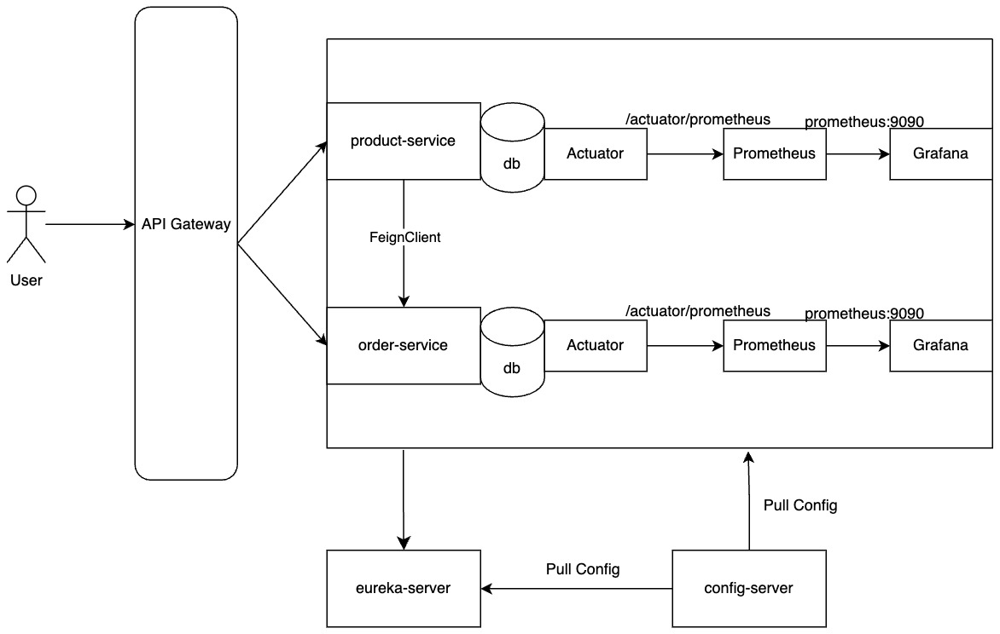

# Microservices E-Commerce Project

[English](#english) | [Türkçe](#türkçe)

<a name="english"></a>
## English

### Table of Contents
- [System Architecture](#system-architecture)
- [Technology Stack](#technology-stack)
- [Service Architecture](#service-architecture)
- [Monitoring and Observability](#monitoring-and-observability)
- [Getting Started](#getting-started)
- [Database](#database)
- [API Documentation](#api-documentation)
- [Monitoring](#monitoring)
- [Test Results](#test-results)

### System Architecture

<p align="center">
    
</p>

### Technology Stack

- Java 21
- Spring Boot 3.4.5
- Spring Cloud
- PostgreSQL
- Docker & Docker Compose
- Prometheus & Grafana (Monitoring)
- Eureka Server (Service Discovery)
- API Gateway
- Config Server

### Service Architecture

The project includes the following microservices:

1. **Config Server**: Central configuration management
2. **Eureka Server**: Service discovery and load balancing
3. **Gateway Service**: API Gateway and routing
4. **Product Service**: Product management
5. **Order Service**: Order management

### Monitoring and Observability

- Prometheus: Metric collection
- Grafana: Metric visualization and dashboards
- Spring Boot Actuator: Service health and metrics

### Getting Started

#### Prerequisites

- Docker and Docker Compose
- Java 21
- PostgreSQL

#### Installation

1. Clone the project:
```bash
git clone 
```

2. Start Docker containers:
```bash
docker-compose up -d
```

3. Start services in order:
    - Config Server
    - Eureka Server
    - Other services

### Access Points

- Eureka Server: http://localhost:8761
- API Gateway: http://localhost:8080
- Prometheus: http://localhost:9090
- Grafana: http://localhost:3000

### Database

PostgreSQL database runs on Docker:
- Port: 5432
- Username: postgres
- Password: toor

### API Documentation

For API endpoints and usage, see the Postman collection: `ecommerce.postman_collection.json`

### Monitoring

To view system metrics on Grafana:
- URL: http://localhost:3000
- Username: admin
- Password: admin

### Test Results

#### Product Service Tests
1. Create Product ✅
   - Successfully created product with ID: 2
   - Response: 200 OK

2. List All Products ✅
   - Successfully retrieved all products
   - Response: 200 OK

3. Get Product by ID ✅
   - Successfully retrieved product details
   - Response: 200 OK

4. Update Product ✅
   - Successfully updated product details
   - Response: 200 OK

5. Delete Product ✅
   - Successfully deleted product
   - Response: 200 OK

#### Order Service Tests
1. Create Order ✅
   - Successfully created order with ID: 2
   - Response: 200 OK

2. Get Order Details ✅
   - Successfully retrieved order details
   - Response: 200 OK

3. Update Order Status ✅
   - Successfully updated status to PENDING
   - Response: 200 OK

4. Cancel Order ✅
   - Successfully cancelled order
   - Response: 200 OK

#### Business Rules Tested
1. Order Status Rules:
   - Cannot cancel order with null status
   - Cannot cancel order with CONFIRMED status
   - Can cancel order with PENDING status


## Türkçe

### İçindekiler
- [Sistem Mimarisi](#sistem-mimarisi)
- [Teknoloji Altyapısı](#teknoloji-altyapısı)
- [Servis Mimarisi](#servis-mimarisi)
- [İzleme ve Gözlemleme](#izleme-ve-gözlemleme)
- [Başlangıç](#başlangıç)
- [Veritabanı](#veritabanı)
- [API Dokümantasyonu](#api-dokümantasyonu)
- [İzleme](#izleme)
- [Test Sonuçları](#test-sonuçları)

### Sistem Mimarisi

<p align="center">
    
</p>

### Teknoloji Altyapısı

- Java 21
- Spring Boot 3.4.5
- Spring Cloud
- PostgreSQL
- Docker & Docker Compose
- Prometheus & Grafana (İzleme)
- Eureka Server (Servis Keşfi)
- API Gateway
- Config Server

### Servis Mimarisi

Proje aşağıdaki mikroservisleri içermektedir:

1. **Config Server**: Merkezi konfigürasyon yönetimi
2. **Eureka Server**: Servis keşfi ve yük dengeleme
3. **Gateway Service**: API Gateway ve yönlendirme
4. **Product Service**: Ürün yönetimi
5. **Order Service**: Sipariş yönetimi

### İzleme ve Gözlemleme

- Prometheus: Metrik toplama
- Grafana: Metrik görselleştirme ve dashboard'lar
- Spring Boot Actuator: Servis sağlığı ve metrikleri

### Başlangıç

#### Ön Gereksinimler

- Docker ve Docker Compose
- Java 21
- PostgreSQL

#### Kurulum

1. Projeyi klonlayın:
```bash
git clone 
```

2. Docker container'larını başlatın:
```bash
docker-compose up -d
```

3. Servisleri sırasıyla başlatın:
    - Config Server
    - Eureka Server
    - Diğer servisler

### Erişim Noktaları

- Eureka Server: http://localhost:8761
- API Gateway: http://localhost:8080
- Prometheus: http://localhost:9090
- Grafana: http://localhost:3000

### Veritabanı

PostgreSQL veritabanı Docker üzerinde çalışmaktadır:
- Port: 5432
- Kullanıcı adı: postgres
- Şifre: toor

### API Dokümantasyonu

API endpoint'leri ve kullanımları için Postman koleksiyonu: `ecommerce.postman_collection.json`

### İzleme

Grafana üzerinden sistem metriklerini görüntülemek için:
- URL: http://localhost:3000
- Kullanıcı adı: admin
- Şifre: admin

### Test Sonuçları

#### Ürün Servisi Testleri
1. Ürün Oluşturma ✅
   - ID: 2 ile başarıyla ürün oluşturuldu
   - Yanıt: 200 OK

2. Tüm Ürünleri Listeleme ✅
   - Tüm ürünler başarıyla getirildi
   - Yanıt: 200 OK

3. ID'ye Göre Ürün Getirme ✅
   - Ürün detayları başarıyla getirildi
   - Yanıt: 200 OK

4. Ürün Güncelleme ✅
   - Ürün detayları başarıyla güncellendi
   - Yanıt: 200 OK

5. Ürün Silme ✅
   - Ürün başarıyla silindi
   - Yanıt: 200 OK

#### Sipariş Servisi Testleri
1. Sipariş Oluşturma ✅
   - ID: 2 ile başarıyla sipariş oluşturuldu
   - Yanıt: 200 OK

2. Sipariş Detayı Getirme ✅
   - Sipariş detayları başarıyla getirildi
   - Yanıt: 200 OK

3. Sipariş Durumu Güncelleme ✅
   - Durum PENDING olarak başarıyla güncellendi
   - Yanıt: 200 OK

4. Sipariş İptal Etme ✅
   - Sipariş başarıyla iptal edildi
   - Yanıt: 200 OK

#### Test Edilen İş Kuralları
1. Sipariş Durumu Kuralları:
   - Null durumundaki sipariş iptal edilemez
   - CONFIRMED durumundaki sipariş iptal edilemez
   - PENDING durumundaki sipariş iptal edilebilir